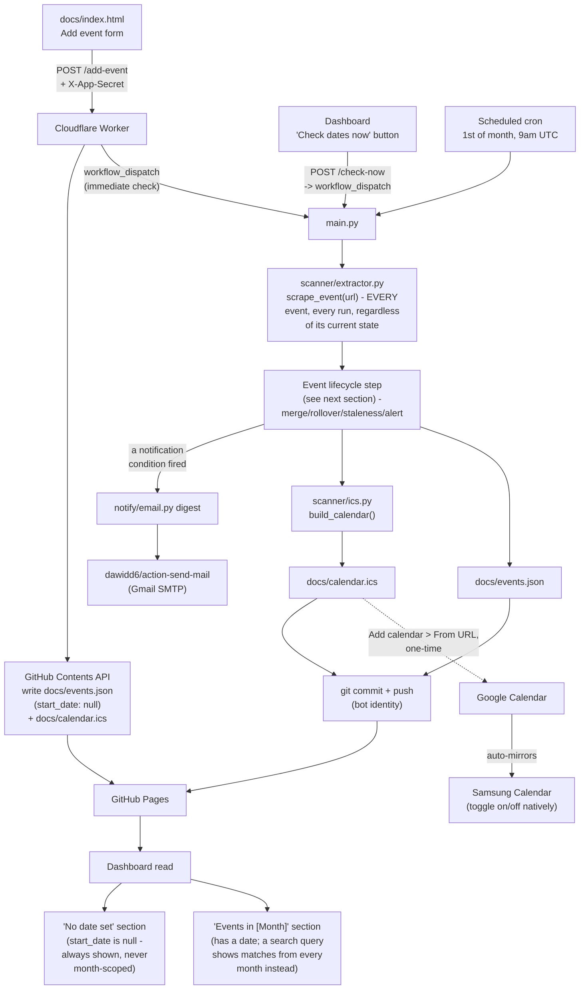

# Architecture

How this system is built and why. For setup and day-to-day changes, see
[INSTRUCTIONS.md](INSTRUCTIONS.md) instead.

## Design constraint: zero paid infrastructure

Same constraint as `job-scraper` and `meal-tracker`: everything here runs on
free tiers, no paid API, no server you're renting. The pieces:

- **GitHub Actions** — runs the monthly re-check on a schedule, does all the
  scraping work.
- **A git-committed JSON file** (`docs/events.json`) — the database.
- **GitHub Pages** (serving `docs/`) — the dashboard. Static HTML/JS, reads
  `events.json` and `calendar.ics` directly.
- **A single Cloudflare Worker** — the only thing that ever holds secrets or
  writes data in real time (adding/editing/deleting an event from the
  dashboard). Everything else is read-only static files.
- **A generated `.ics` feed** (`docs/calendar.ics`), subscribed to once in
  Google Calendar — this is the Samsung Calendar sync path `meal-tracker`'s
  ARCHITECTURE.md named but never built. Samsung Calendar automatically
  mirrors Google account calendars, so no native Android code is needed, and
  toggling the calendar on/off is just the native checkbox in either app's
  calendar list.
- If the built-in extraction heuristics (below) both fail, an optional last
  resort calls **Cloudflare Workers AI** (free tier) rather than the
  Anthropic API — per-request billing there would violate the $0 constraint,
  and Workers AI's free daily allowance fails closed instead of ever
  charging. This is a pure accuracy improvement, never a dependency: it's
  skipped entirely if `CLOUDFLARE_ACCOUNT_ID`/`CLOUDFLARE_API_TOKEN` aren't
  set as repo secrets.

## Why "couldn't find a date" has to be a normal state, not an error

A real test against `glastonburyfestivals.co.uk` (2026-08-28) found no
structured data at all — just prose mentioning a "Fallow 2026" year and a
"2027 tickets" prize draw, with no parseable date anywhere on the page. Real
festival sites routinely go months between one year's event ending and the
next year's date being announced. `scanner/extractor.py` treats "found
nothing" as a normal return value (`{}`), not an exception, and the whole
alert system (`scanner/alerts.py`) exists specifically to surface this
gracefully instead of silently going stale.

## End-to-end flow



Two independent write paths, same split as `meal-tracker`: the Worker
handles anything you do in real time (add/edit/delete, notes, tags), the
scan handles the actual re-checking of event pages — and there are three
separate ways a scan gets triggered (see diagram): immediately after adding
an event, on demand via the dashboard's "Check dates now" button (or the
Actions tab's "Run workflow"), and automatically once a month. All three
run the exact same `main.py` end to end, over *every* tracked event, not
just a specific one — there's no per-event "just check this one" scan, so
adding one event or clicking "Check dates now" both end up re-verifying
everything. The scraping logic lives in exactly one place (Python); the
Worker's `buildIcs()` is a small JS port of `scanner/ics.py`'s ICS-building
logic (kept in sync manually), needed so the Worker's own writes update the
calendar immediately rather than waiting for the next scan.

## Repo layout

```
calendar-app/
  main.py                      # orchestrator, mirrors job-scraper/main.py
  requirements.txt
  scanner/
    extractor.py                # scrape_event(url) -> partial fields
    ics.py                        # events.json -> calendar.ics
    alerts.py                     # event lifecycle: staleness + alert timing
  notify/
    email.py                      # alert digest (adapted from job-scraper)
  worker/
    worker.js                     # Cloudflare Worker, mirrors meal-tracker's
    wrangler.toml                  # Worker config for automated deploys - see below
  docs/                           # GitHub Pages root — the only public folder
    index.html                    # dashboard
    events.json                   # the database
    calendar.ics                  # generated feed
    manifest.json                  # lets index.html be "installed" to a home screen
    icons/                          # 🔮 favicon/home-screen icon set, same idea as job-scraper's
  .github/workflows/
    monthly-check.yml              # the actual cron job
    deploy-worker.yml              # deploys worker/ to Cloudflare on every push that touches it
  INSTRUCTIONS.md
  ARCHITECTURE.md
```

## Automatic Worker deployment

Cloudflare Workers don't auto-deploy from a git push the way GitHub Pages
does — without anything extra, every change to `worker/worker.js` needs
manually pasting into the Cloudflare dashboard's code editor and hitting
Deploy. `.github/workflows/deploy-worker.yml` removes that step: it runs
`cloudflare/wrangler-action` on any push that touches `worker/`,
authenticated with a `CLOUDFLARE_API_TOKEN` GitHub Actions secret scoped
narrowly to **Workers Scripts: Edit** on this account (nothing broader) plus
a `CLOUDFLARE_ACCOUNT_ID` secret. Same mechanism `meal-tracker` uses.

`worker/wrangler.toml` deliberately declares the non-secret vars
(`GITHUB_OWNER`, `GITHUB_REPO`, `ALLOWED_ORIGIN`) explicitly, even though
they were already set via the dashboard during initial setup — once a
Worker starts being deployed through Wrangler (CLI or CI, same mechanism),
Wrangler treats the config file as the source of truth for bindings and
plain variables, and *can* silently drop anything set only in the dashboard
that isn't also declared in the file. The encrypted secrets (`GITHUB_TOKEN`,
`APP_SECRET`) are the one exception to this — Cloudflare never deletes a
secret as part of a deploy regardless of what the config file contains, so
they're deliberately *not* in `wrangler.toml` (putting a real secret value
in a version-controlled file would defeat the whole point) and stay managed
exactly as before, via the dashboard's Settings > Variables and Secrets.

One gotcha worth knowing: this repo's `CLOUDFLARE_API_TOKEN` secret may
already exist for a *different* reason (`scanner/extractor.py`'s optional
Workers AI fallback, called from Python inside `monthly-check.yml`, not
from this Worker at all) — that token only has Workers AI permissions, not
Workers Scripts: Edit, so deploying with it as-is will fail. It needs both
permissions, or a second token, since the GitHub secret name is shared
between both workflows. See INSTRUCTIONS.md's setup step 5b.

## The event record

```json
{
  "id": "glastonbury",
  "name": "Glastonbury Festival",
  "url": "https://www.glastonburyfestivals.co.uk/",
  "location": "Worthy Farm, Pilton, Somerset",
  "start_date": "2027-06-23",
  "end_date": "2027-06-27",
  "is_free": false,
  "price_text": "£375 + booking fee",
  "region": "uk",
  "tags": ["music", "festival"],
  "notes": "Try the October resale window if the main sale sells out.",
  "last_known_year": 2025,
  "last_known_month": 6,
  "last_checked": "2026-08-28T09:00:00+00:00",
  "alert_sent_for_year": null,
  "went_stale_notified_for_year": null,
  "calendar_uid": "glastonbury@calendar-app.apineschi"
}
```

- `start_date`/`end_date`/`location`/`is_free`/`price_text` are `null` until
  actually found — `main.py` merges in whatever `scrape_event()` returns
  field-by-field, and never lets a missing field overwrite a previously
  stored value ("couldn't find it this run" isn't the same as "it's now
  unknown"). Unlike the others, `start_date`/`end_date` *can* later be
  cleared back to `null` deliberately — see "Event lifecycle" below.
- `last_known_year` / `last_known_month` are the persistent memory of "when
  this event last happened" — set the first time any date is found, and
  updated again on a rollover to a genuinely later year. Unlike
  `start_date`/`end_date`, these are **never** cleared, which is exactly why
  they exist separately: `scanner/alerts.py`'s "still needs attention" check
  needs to know the expected month even after the actual date has been
  wiped back to "no date set." A manual date correction via `/edit-event`
  updates them the same way a scan finding one does.
- `alert_sent_for_year` / `went_stale_notified_for_year` dedupe the two
  notification points in the lifecycle below, each independently, so
  neither re-fires every single scan once triggered. Both are cleared
  together the moment a genuinely new (later-year) date is found, so the
  next time this same event cycles through, it can notify again.
- `calendar_uid` is a stable per-event UID so regenerating `calendar.ics`
  updates the existing entry in Google Calendar rather than creating a
  duplicate on its next poll.
- Tags are free-text, entered on the dashboard — kept separate from
  `is_free`/`price_text`/`region` since those were asked for as their own
  always-available filter categories, not as part of the freeform
  type-of-event tagging. `region` (`"uk"` | `"international"` | `null`) is
  its own dedicated field with a real dropdown in the add/edit forms, same
  as `is_free` — an earlier version tried representing it as a plain tag
  (typing "uk" into the tags box) instead, which meant nothing ever actually
  set it and the UK/International filter silently matched nothing.

## Event extraction (`scanner/extractor.py`)

Layered, cheapest and most reliable first, same philosophy as
`job-scraper/scrapers/base.py`'s label-scanning approach but generic (no
per-site modules, since URLs here are arbitrary, user-supplied festival
sites rather than a fixed list of institutions):

1. **schema.org JSON-LD** (`<script type="application/ld+json">` with an
   `@type` ending in "Event", or the informal "Festival") — `startDate`,
   `endDate`, `location`, `offers.price`/`isAccessibleForFree`. Reliable
   when present (ticketing platforms, WordPress event plugins); handles
   being wrapped in a list or `@graph`.
2. **Open Graph tags** — `og:title` only, for the name. Not trusted for
   dates.
3. **Text heuristics** — regex scan for date-shaped snippets, parsed with
   `dateutil`. Two real bugs turned up testing this against
   `lovesupremefestival.com` (no JSON-LD, prose only), both fixed and worth
   knowing about if extraction ever looks wrong on a new site:
   - A day *range* like "2-4 July 2027" was silently mis-parsed as "4 July
     2027" - the single-day pattern only ever captured a lone day
     immediately before the month name, dropping the real start day
     entirely. `extract_date_range_from_text()` (tried first, before the
     single-day fallback) handles `D1-D2 Month Year` explicitly and returns
     both `start_date` and `end_date`.
   - A ticket-sale deadline ("Early Bird Tickets Only until 7th August
     2026") was confidently returned as the event's date. `TICKET_CONTEXT_RE`
     now skips any date-shaped snippet with ticket/sale/deadline language in
     the ~80 characters before it.
   - `_guess_location_after()` is a light-touch bonus: on pages where the
     venue sits right after the date in the flattened text (as on the same
     Love Supreme page: "2-4 July 2027 Glynde Place, East Sussex"), it's
     captured as a location guess, cut off at the first digit or
     site-chrome-looking word (nav labels, section headings). Wrong guesses
     just get corrected via the dashboard's edit form, same as any other
     best-effort field.
4. **Headless browser retry** (`fetch_html_with_browser()`, Playwright +
   Chromium) — tried whenever the plain fetch either failed outright or
   succeeded but found no date, covering both "the site blocks non-browser
   requests" and "the site is a client-side-rendered shell with nothing in
   the raw HTML." Whatever it finds is merged in through the same
   `_extract_deterministic()` pass (steps 1-3 again, against the
   browser-rendered HTML this time) rather than a separate code path.
   **Real limit found testing this against `womad.co.uk`**: it returns the
   *identical* 403 Forbidden page to headless Chromium as to a plain
   `requests` call - meaning it's fingerprinting the browser as automated
   (Cloudflare-style bot detection), not just checking the User-Agent
   header. Playwright genuinely helps for sites that are merely
   JS-rendered; it can't be expected to get past a site actively hostile to
   automation, and going further down that road (fingerprint spoofing,
   proxies) wasn't attempted - manual entry via the dashboard's edit form is
   the answer for a site like that.
5. **Cloudflare Workers AI** (optional, free-tier only) — only tried if 1-4
   all found no date, against whichever page content is best available (the
   browser-rendered version if step 4 ran); asks a free model to read the
   page's own text and extract the same fields as structured JSON.
6. Anything still missing is left absent from the returned dict. This is the
   expected, common outcome (see the Glastonbury test above) — not a bug to
   fix, and exactly what `scanner/alerts.py` exists to handle.

Adding an event via the dashboard triggers an immediate check rather than
waiting for the monthly schedule: the Worker's `/add-event` (and a standalone
`/check-now`, for rechecking everything on demand - e.g. after fixing a
mistyped URL) call GitHub's `workflow_dispatch` API to kick off
`monthly-check.yml` right away. This needs the fine-grained PAT to also have
**Actions: Read and write**, not just Contents (see INSTRUCTIONS.md) - without
it, the dispatch call fails silently (logged, but never blocks the event
itself from saving) and the event just waits for the next scheduled run.

## Event lifecycle (`scanner/alerts.py`) — when things get scanned, and when you get notified

Every event is always in one of two states, `NoDateSet` (`start_date` is
`null`) or `HasDate`. **Scanning itself doesn't depend on which state an
event is in** — every trigger (add, "Check dates now", or the monthly cron)
re-runs `scrape_event()` against *every* event regardless of state, so a
dateless event is retried automatically on whatever cadence those triggers
happen to occur, with no separate "wait N days then check" timer needed for
that part. What *does* depend on state is whether a date gets **cleared**
and whether a **notification** fires:

```mermaid
stateDiagram-v2
    [*] --> NoDateSet
    NoDateSet --> HasDate: a scan finds a date\n(main.py's per-event loop;\nsets last_known_year/month)
    HasDate --> HasDate: a later scan reconfirms\nor updates the date
    HasDate --> NoDateSet: today > end_date + 30 days\nAND nothing newer was found\n(check_staleness())\n📧 "just went stale" - once\nper last_known_year
    note right of NoDateSet
        Dashboard: this is the
        "No date set" section -
        always shown, never
        scoped to a calendar month.

        📧 "still needs attention"
        (compute_alert()) fires once
        when today reaches 3 months
        before the expected month of
        (last_known_year + 1) - only
        for events that HAVE had a
        date before. A brand-new
        event with no history yet
        never triggers this one.

        Both notification dedupe
        flags clear together the
        moment a genuinely later
        date is found, so the next
        time this event goes quiet
        it can notify again.
    end note
```



Worked example for a festival that ran 24-26 July 2025 (so
`last_known_year=2025`, `last_known_month=7`) and doesn't get a 2026 date
published in time (verified against the real code, not just narrated):

| When | What happens |
|---|---|
| 24-26 July 2025 | The event happens; `last_known_year=2025`, `last_known_month=7` |
| 25 Aug 2025 (`end_date` + 30 days) | Next scan: `check_staleness()` clears `start_date`/`end_date` to `null` → moves to `NoDateSet` on the dashboard → **📧 "just went stale"** email (once) |
| Sept 2025 → March 2026 | Still `NoDateSet`; every scan keeps retrying automatically; no more email yet |
| 1 April 2026 (3 months before the expected July 2026) | `compute_alert()` fires → **📧 "still needs attention"** email (once) |
| Whenever a 2026 (or later) date is eventually found | Back to `HasDate`; both dedupe flags clear, ready for the next cycle |

`notify/email.py`'s digest sends both notification kinds in one email when
both fire in the same run (rare, but not guarded against — a "just went
stale" and "still needs attention" for two different events, or even the
same one, are both legitimate and harmless to report together).

## Known limitations (MVP)

- **Bot-protected sites can't be scraped at all**: `womad.co.uk` is the
  known example - it blocks both a plain `requests` call and headless
  Chromium identically (see step 4 above). No code change here will fix
  that; the date/location for a site like this has to be entered manually
  via the dashboard's edit form.
- **The Playwright fallback adds real time to every scan**: launching a real
  browser only happens for events the plain fetch already failed on, but
  for those it's meaningfully slower than a plain HTTP request. Not an
  issue at the scale of a handful of personal events; would be worth
  revisiting if this ever tracked hundreds.
- **Text-heuristic date guesses aren't verified**: step 3 above picks the
  earliest plausible-looking date in the page text, which can occasionally
  pick up an unrelated date mentioned nearby. A wrong guess gets overwritten
  by the next correct scan, or can be fixed immediately via the dashboard's
  edit form.
- **One Worker, one user**: same as `meal-tracker` — a single shared
  `APP_SECRET`, no real multi-user auth. Fine for a personal app.
- **The 30-day staleness grace period is fixed in code** (`STALE_GRACE_DAYS`
  in `scanner/alerts.py`), not configurable from the dashboard. Long enough
  in practice for most organizers to publish next year's date, but an event
  with an unusually slow announcement cycle would get cleared to "no date
  set" (and one stale-notification email) before a genuinely-late date
  shows up — which just means the following month's scan naturally finds
  it and moves it back to `HasDate`, so it self-corrects, just with one
  extra email in between.
