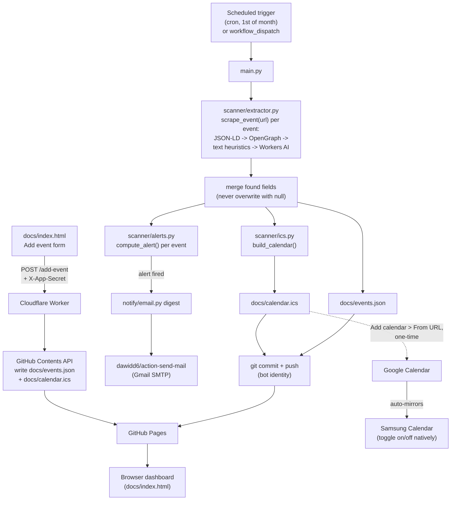

# Architecture

How this system is built and why. For setup and day-to-day changes, see
[INSTRUCTIONS.md](INSTRUCTIONS.md) instead.

## Design constraint: zero paid infrastructure

Same constraint as `job-scraper` and `meal-tracker`: everything here runs on
free tiers, no paid API, no server you're renting. The pieces:

- **GitHub Actions** — runs the monthly re-check on a schedule, does all the
  scraping work.
- **A git-committed JSON file** (`docs/events.json`) — the database.
- **GitHub Pages** (serving `docs/`) — the dashboard. Static HTML/JS, reads
  `events.json` and `calendar.ics` directly.
- **A single Cloudflare Worker** — the only thing that ever holds secrets or
  writes data in real time (adding/editing/deleting an event from the
  dashboard). Everything else is read-only static files.
- **A generated `.ics` feed** (`docs/calendar.ics`), subscribed to once in
  Google Calendar — this is the Samsung Calendar sync path `meal-tracker`'s
  ARCHITECTURE.md named but never built. Samsung Calendar automatically
  mirrors Google account calendars, so no native Android code is needed, and
  toggling the calendar on/off is just the native checkbox in either app's
  calendar list.
- If the built-in extraction heuristics (below) both fail, an optional last
  resort calls **Cloudflare Workers AI** (free tier) rather than the
  Anthropic API — per-request billing there would violate the $0 constraint,
  and Workers AI's free daily allowance fails closed instead of ever
  charging. This is a pure accuracy improvement, never a dependency: it's
  skipped entirely if `CLOUDFLARE_ACCOUNT_ID`/`CLOUDFLARE_API_TOKEN` aren't
  set as repo secrets.

## Why "couldn't find a date" has to be a normal state, not an error

A real test against `glastonburyfestivals.co.uk` (2026-08-28) found no
structured data at all — just prose mentioning a "Fallow 2026" year and a
"2027 tickets" prize draw, with no parseable date anywhere on the page. Real
festival sites routinely go months between one year's event ending and the
next year's date being announced. `scanner/extractor.py` treats "found
nothing" as a normal return value (`{}`), not an exception, and the whole
alert system (`scanner/alerts.py`) exists specifically to surface this
gracefully instead of silently going stale.

## End-to-end flow



Two independent write paths, same split as `meal-tracker`: the Worker
handles anything you do in real time (add/edit/delete, notes, tags), the
scheduled scan handles the actual re-checking of event pages. A brand-new
event added via the Worker starts with `start_date: null` ("date pending" on
the dashboard) — the next scheduled run, or a manual `workflow_dispatch`
from the Actions tab, fills it in. The scraping logic lives in exactly one
place (Python); the Worker's `buildIcs()` is a small JS port of
`scanner/ics.py`'s ICS-building logic (kept in sync manually), needed so the
Worker's own writes update the calendar immediately rather than waiting for
the next monthly scan.

## Repo layout

```
calendar-app/
  main.py                      # orchestrator, mirrors job-scraper/main.py
  requirements.txt
  scanner/
    extractor.py                # scrape_event(url) -> partial fields
    ics.py                        # events.json -> calendar.ics
    alerts.py                     # "can't find next date" logic
  notify/
    email.py                      # alert digest (adapted from job-scraper)
  worker/
    worker.js                     # Cloudflare Worker, mirrors meal-tracker's
  docs/                           # GitHub Pages root — the only public folder
    index.html                    # dashboard
    events.json                   # the database
    calendar.ics                  # generated feed
    manifest.json                  # lets index.html be "installed" to a home screen
    icons/                          # 🔮 favicon/home-screen icon set, same idea as job-scraper's
  .github/workflows/
    monthly-check.yml              # the actual cron job
  INSTRUCTIONS.md
  ARCHITECTURE.md
```

## The event record

```json
{
  "id": "glastonbury",
  "name": "Glastonbury Festival",
  "url": "https://www.glastonburyfestivals.co.uk/",
  "location": "Worthy Farm, Pilton, Somerset",
  "start_date": "2027-06-23",
  "end_date": "2027-06-27",
  "is_free": false,
  "price_text": "£375 + booking fee",
  "region": "uk",
  "tags": ["music", "festival"],
  "notes": "Try the October resale window if the main sale sells out.",
  "last_known_year": 2025,
  "last_checked": "2026-08-28T09:00:00+00:00",
  "alert_sent_for_year": null,
  "calendar_uid": "glastonbury@calendar-app.apineschi"
}
```

- `start_date`/`end_date`/`location`/`is_free`/`price_text` are `null` until
  actually found — `main.py` merges in whatever `scrape_event()` returns
  field-by-field, and never lets a missing field overwrite a previously
  stored value ("couldn't find it this run" isn't the same as "it's now
  unknown").
- `last_known_year` is the year of the most recently *confirmed* date — set
  the first time any date is found, and the baseline `alerts.py` measures 3
  months back from. A manual date correction via `/edit-event` also updates
  it, same as a scan finding one.
- `alert_sent_for_year` dedupes the "can't find it" email so it only fires
  once per missing year, not every month once triggered. Cleared as soon as
  a date for that year (or later) shows up.
- `calendar_uid` is a stable per-event UID so regenerating `calendar.ics`
  updates the existing entry in Google Calendar rather than creating a
  duplicate on its next poll.
- Tags are free-text, entered on the dashboard — kept separate from
  `is_free`/`price_text`/`region` since those were asked for as their own
  always-available filter categories, not as part of the freeform
  type-of-event tagging. `region` (`"uk"` | `"international"` | `null`) is
  its own dedicated field with a real dropdown in the add/edit forms, same
  as `is_free` — an earlier version tried representing it as a plain tag
  (typing "uk" into the tags box) instead, which meant nothing ever actually
  set it and the UK/International filter silently matched nothing.

## Event extraction (`scanner/extractor.py`)

Layered, cheapest and most reliable first, same philosophy as
`job-scraper/scrapers/base.py`'s label-scanning approach but generic (no
per-site modules, since URLs here are arbitrary, user-supplied festival
sites rather than a fixed list of institutions):

1. **schema.org JSON-LD** (`<script type="application/ld+json">` with an
   `@type` ending in "Event", or the informal "Festival") — `startDate`,
   `endDate`, `location`, `offers.price`/`isAccessibleForFree`. Reliable
   when present (ticketing platforms, WordPress event plugins); handles
   being wrapped in a list or `@graph`.
2. **Open Graph tags** — `og:title` only, for the name. Not trusted for
   dates.
3. **Text heuristics** — regex scan for date-shaped snippets, parsed with
   `dateutil`. Two real bugs turned up testing this against
   `lovesupremefestival.com` (no JSON-LD, prose only), both fixed and worth
   knowing about if extraction ever looks wrong on a new site:
   - A day *range* like "2-4 July 2027" was silently mis-parsed as "4 July
     2027" - the single-day pattern only ever captured a lone day
     immediately before the month name, dropping the real start day
     entirely. `extract_date_range_from_text()` (tried first, before the
     single-day fallback) handles `D1-D2 Month Year` explicitly and returns
     both `start_date` and `end_date`.
   - A ticket-sale deadline ("Early Bird Tickets Only until 7th August
     2026") was confidently returned as the event's date. `TICKET_CONTEXT_RE`
     now skips any date-shaped snippet with ticket/sale/deadline language in
     the ~80 characters before it.
   - `_guess_location_after()` is a light-touch bonus: on pages where the
     venue sits right after the date in the flattened text (as on the same
     Love Supreme page: "2-4 July 2027 Glynde Place, East Sussex"), it's
     captured as a location guess, cut off at the first digit or
     site-chrome-looking word (nav labels, section headings). Wrong guesses
     just get corrected via the dashboard's edit form, same as any other
     best-effort field.
4. **Headless browser retry** (`fetch_html_with_browser()`, Playwright +
   Chromium) — tried whenever the plain fetch either failed outright or
   succeeded but found no date, covering both "the site blocks non-browser
   requests" and "the site is a client-side-rendered shell with nothing in
   the raw HTML." Whatever it finds is merged in through the same
   `_extract_deterministic()` pass (steps 1-3 again, against the
   browser-rendered HTML this time) rather than a separate code path.
   **Real limit found testing this against `womad.co.uk`**: it returns the
   *identical* 403 Forbidden page to headless Chromium as to a plain
   `requests` call - meaning it's fingerprinting the browser as automated
   (Cloudflare-style bot detection), not just checking the User-Agent
   header. Playwright genuinely helps for sites that are merely
   JS-rendered; it can't be expected to get past a site actively hostile to
   automation, and going further down that road (fingerprint spoofing,
   proxies) wasn't attempted - manual entry via the dashboard's edit form is
   the answer for a site like that.
5. **Cloudflare Workers AI** (optional, free-tier only) — only tried if 1-4
   all found no date, against whichever page content is best available (the
   browser-rendered version if step 4 ran); asks a free model to read the
   page's own text and extract the same fields as structured JSON.
6. Anything still missing is left absent from the returned dict. This is the
   expected, common outcome (see the Glastonbury test above) — not a bug to
   fix, and exactly what `scanner/alerts.py` exists to handle.

Adding an event via the dashboard triggers an immediate check rather than
waiting for the monthly schedule: the Worker's `/add-event` (and a standalone
`/check-now`, for rechecking everything on demand - e.g. after fixing a
mistyped URL) call GitHub's `workflow_dispatch` API to kick off
`monthly-check.yml` right away. This needs the fine-grained PAT to also have
**Actions: Read and write**, not just Contents (see INSTRUCTIONS.md) - without
it, the dispatch call fails silently (logged, but never blocks the event
itself from saving) and the event just waits for the next scheduled run.

## The "can't find next date" alert (`scanner/alerts.py`)

For an event with a known `last_known_year` (say 2025) and a known month
(derived from its current `start_date`, since that field is never cleared
once set):

```
target_year = last_known_year + 1                     # 2026
alert_start = (that month, target_year) minus 3 months  # e.g. May 2026 for an August event
if today >= alert_start and no date found yet for target_year (or later):
    fire the alert once (dedupe via alert_sent_for_year)
```

Brand-new events that have never had *any* date found have no baseline year
to alert against — they just show "date pending" on the dashboard
indefinitely; no email fires for those. The rule as asked for is specifically
about a recurring event's next occurrence going quiet, not about a first-time
scrape still being in progress.

## Known limitations (MVP)

- **Bot-protected sites can't be scraped at all**: `womad.co.uk` is the
  known example - it blocks both a plain `requests` call and headless
  Chromium identically (see step 4 above). No code change here will fix
  that; the date/location for a site like this has to be entered manually
  via the dashboard's edit form.
- **The Playwright fallback adds real time to every scan**: launching a real
  browser only happens for events the plain fetch already failed on, but
  for those it's meaningfully slower than a plain HTTP request. Not an
  issue at the scale of a handful of personal events; would be worth
  revisiting if this ever tracked hundreds.
- **Text-heuristic date guesses aren't verified**: step 3 above picks the
  earliest plausible-looking date in the page text, which can occasionally
  pick up an unrelated date mentioned nearby. A wrong guess gets overwritten
  by the next correct scan, or can be fixed immediately via the dashboard's
  edit form.
- **One Worker, one user**: same as `meal-tracker` — a single shared
  `APP_SECRET`, no real multi-user auth. Fine for a personal app.
